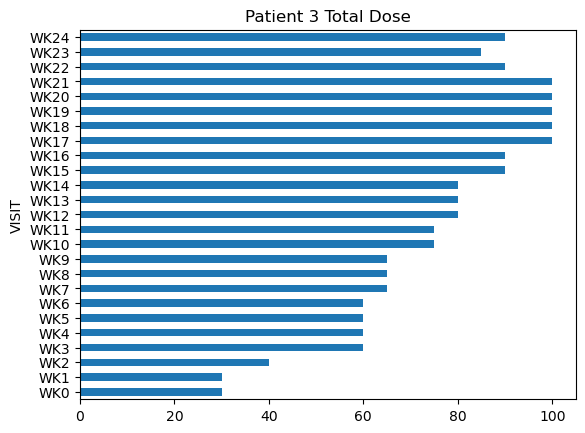

### Individual Level Predictive Modeling for Opioid Use Disorder Treatment Outcome
Jul 2023 - Present

I'm currently working on a personal project, where the goal is to show how machine learning can improve outcomes for treatment of Opioid Use Disorder (OUD).   I received guidance from Dr. Sean Luo, who designed the protocol for the project.

There is an Opioid Crisis in the united states, where close to 1,500 Americans are dying every week from Fentanyl.  Fentanyl is an artificially manufactured Opioid that is 100 times stronger than morphine.  Fentanyl has been increasingly prevalent in the illicit drug supply.  The DEA estimates that 6 out of 10 illicit pain pills are cut with Fentanyl.  People who are dying from Fentanyl are mostly working class people who suffered from chronic pain and were wrongly prescribed opiates, which are not designed for long term use.  If you are a veteran, you are disproportionately affected and are twice as likely to die from Fentanyl.  When people can't get pain meds through pharmacies, they will go through illicit channels and risk death from exposure to Fentanyl.

There is strong evidence indicating the effectiveness of opioid agonist treatment.  Mediations such as Methadone, Buprenorphine and Extended Release Naltrexone, can help prevent death from Fentanyl.  However, the prescription of these meds is mostly arbitrary, not backed by sound scientific evidence, mostly done for convenience, based on opinions.  Also, people who recover do so in different trajectories.  This creates a challenge and opportunity for precision medicine.  Personalized risk scores can promote patient centered care, similar to cancer treatment.

To address this problem, we observed dataset NIDA-CTN-0027 from the CTN.  This dataset includes data for 1,200 patients receiving treatment at 8 different centers.  We will monitor medication doses, urine toxicology and self reported use, within the first 30 days of treatment.  We will attempt to predict if the patient will successfully complete treatment by showing 4 consecutive clean urine screens at the end of 24 weeks.

