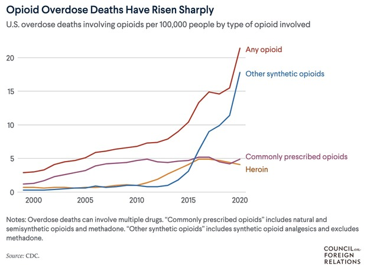
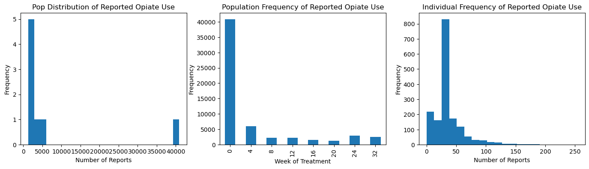
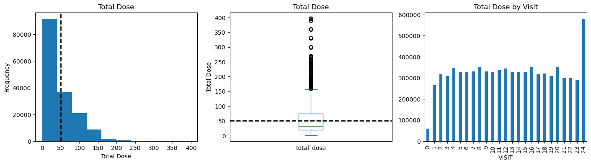
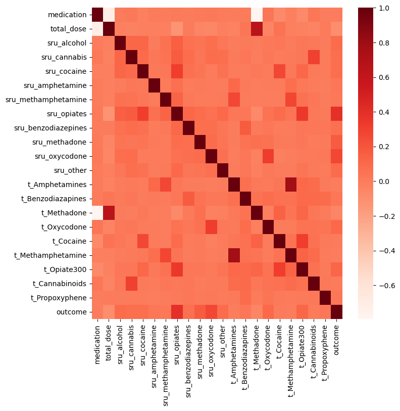
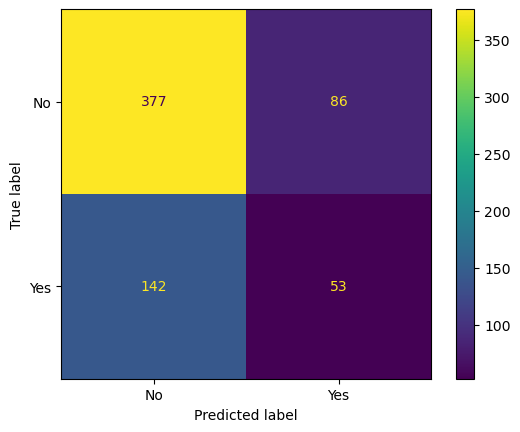
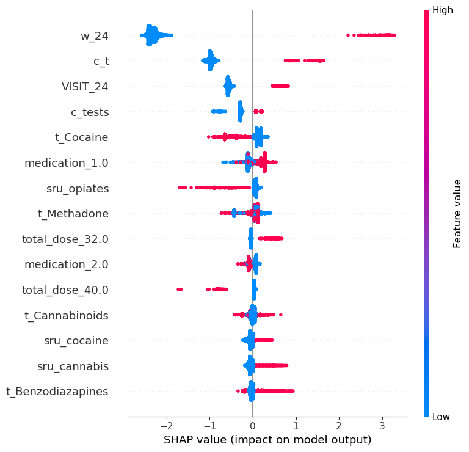

### Individual Level Predictive Modeling for Opioid Use Disorder Treatment Outcome
Jul 2023 - Present

I'm currently working on a personal project, where the goal is to show how machine learning can improve outcomes for treatment of Opioid Use Disorder (OUD).   I received guidance from Dr. Sean Luo, who designed the protocol for the project.

There is an Opioid Crisis in the united states, where close to 1,500 Americans are dying every week from Fentanyl.  Fentanyl is an artificially manufactured Opioid that is 100 times stronger than morphine.  Fentanyl has been increasingly prevalent in the illicit drug supply.  The DEA estimates that 6 out of 10 illicit pain pills are cut with Fentanyl.  People who are dying from Fentanyl are mostly working class people who suffered from chronic pain and were wrongly prescribed opiates, which are not designed for long term use.  If you are a veteran, you are disproportionately affected and are twice as likely to die from Fentanyl.  When people can't get pain meds through pharmacies, they will go through illicit channels and risk death from exposure to Fentanyl.

There is strong evidence indicating the effectiveness of opioid agonist treatment.  Mediations such as Methadone, Buprenorphine and Extended Release Naltrexone, can help prevent death from Fentanyl.  However, the prescription of these meds is mostly arbitrary, not backed by sound scientific evidence, mostly done for convenience, based on opinions.  Also, people who recover do so in different trajectories.  This creates a challenge and opportunity for precision medicine.  Personalized risk scores can promote patient centered care, similar to cancer treatment.

To address this problem, we observed dataset NIDA-CTN-0027 from the CTN.  This dataset includes data for about 1300 patients receiving treatment at 8 different centers.  We monitored medication doses, urine toxicology and self reported use, within the first 30 days of treatment.  We will try to take patient data and train a machine learning model to predict if a patient will or will not successfully complete treatment.

## Preliminary EDA Insights
### Self Reported Drug Use

 
Over a 24 week period, patients filled out surveys to report on drug use 
The data was collected at inception of treatment and every 4 weeks 
Specifically VISIT 0,4,8,12,16,20,24 

### Weekly Drug Tests

 
Patients submitted a urine sample for screening every week for 24 weeks

### Medication Doses

 
There is strong scientific evidence that medication will help prevent relapse from 50% - 90% 
Patients recover in distinct patterns, we hope to better understand the relationship between total dose
and recovery trajectory 

### Correlation 

 
**Interestingly enough, there is a high positive correlation between positive methamphetamine tests and treatment outcomes** 
**Positive methadone tests and medication doses also show positive correlation but not at the same strengrh**

## Preliminary results training 3 different machine learning models

First we will run a basic classification through random forrest 
Then we will try to interpret results through Global Surrogate model 
We will conclude with running XGBoost, a high performance ensemble learning model 
There is a relatively small sample size with 1315 patients 
70% of outcomes are negative (relapse) 
30% of outcomes are positive (prevent relapse) 

 
These are preliminary results from XGBoost; the model was not tuned properly 
After train test split, model predicted 81% of true negative outcomes, 377 patients who relapsed 
The initial set of models performed poorly, only identifying 27% (or 53 patients) with true positive outcomes 
High level of false negatives, missing 72% or 142 patitents who achieved positive outcome 
 

## Feature Importance Analysis
Comming soon 

 

## Shapley Values Analysis 
Comming soon 

