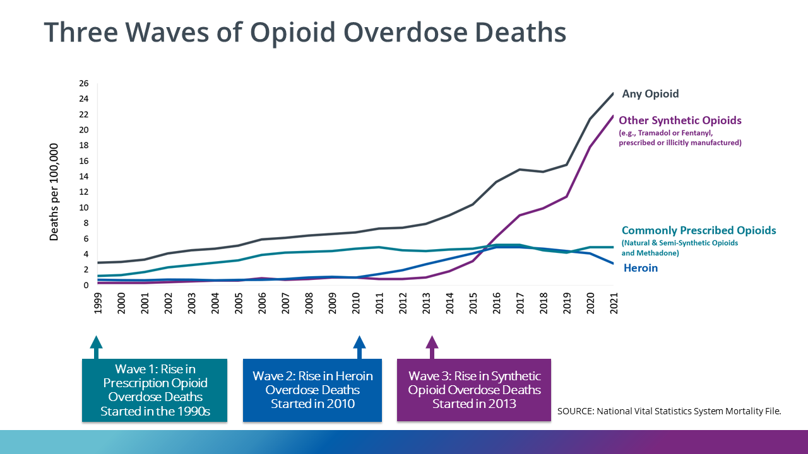

# Data Science Project 
The intention for this project is to show how data science could create positive impact, addressing a serious problem.  For my first project, I chose to study the Opioid Crisis.

# Table of Contents

[Project Overview](#project-overview)  
[The Data](#the-data) 
[The Opioid Crisis](#the-opioid-crisis)  
[Opioid Dependence](#opioid-dependence)  
[Study Endpoints](#study-endpoints)  
[References](#references)  

# Project Overview

The project will involve three phases: 

1) **_Data Wrangling_**: Create a high quality dataset to analyze 500 clinical data points for a population of approximately 1,300 patients

2) **_Analysis_**: Analyze Clinical Data in accordance with the Food and Drug Administration Guidelines[1](#1) for effective treatment outcomes

3) **_Inference_**: Build a machine learning model to extract inference from the data and identify key risk signals to improve treatment outcomes

 

# The Data  
I approached Dr. Sean Luo, who is an addiction psychiatrist and subject matter expert in machine learning.  Dr. Luo advised me to use a dataset that is part of the Clinical Trial Network study CTN0027 [1](#1).  This dataset is a subset of a larger active study that has received federal funding. [2](#2) 

 

# The Opioid Crisis

    

The US is currently experiencing an Opioid Crisis.  In 2021 approximately 107,000 people died from fatal drug overdose.  The number of deaths from drug overdose in 2021 is 6 times greater than the total in 1999[3](#3). The rise in overdose death is directly related to consumption of Fentanyl, a synthetic opioid that is 100x stronger than morphine that's made it's way into the illicit drug supply[4](#4). People who develop problmematic use of opioids, unknowingly get exposed to fentanyl and die tragically. 

 

# Opioid Dependence
 

Opioid tolerance, dependence[6](#6), and addiction are all manifestations of brain changes resulting from chronic opioid abuse. The opioid abuser’s struggle for recovery is in great part a struggle to overcome the effects of these changes.  

# MOUD - Medication Treament for OUD 
 

Methadone, buprenorphine, and extended-release naltrexone are the three medications [7](#7) currently approved by the U.S. Food and Drug Administration (FDA) for treating opioid use disorder (OUD). All three medications reduce opioid cravings and help to sever the ties between opioid use and established situational or emotional triggers.

There is no cure for Opioid Use Disorder, but there is opportunity for remission, if people can reduce patterns of problematic consumption, they will avoid death/suffering and restore quality of life to reasonable levels.  
 

## Study Endpoints

| Topic | Description|Link | Release Date |
| --- | --- | --- | --- |
| Data Wrangling  | Creating a High Quality Dataset for Analysis| Link | 2023/09/01 |
| Data Analysis   | Measuring Treatment Outcomes, according to FDA Guidance |Link | 2023/05/01 |
| Machine Learning | Predicting Treatment Otucomes, Extracting Inference to Identify Risk Signals and Improve Outcomes| Link | 2023/05/01 |

## References 

<a id='1'>[1]</a>
US Food and Drug Administration [Opioid Use Disorder: Endpoints for Demonstrating Effectiveness of Drugs for Treatment](https://www.fda.gov/regulatory-information/search-fda-guidance-documents/opioid-use-disorder-endpoints-demonstrating-effectiveness-drugs-treatment-guidance-industry)

<a id='2'>[2]</a>
National Institute on Drug Abuse Data Share Website: [NIDA-CTN-0027 - Starting Treatment with Agonist Replacement Therapies (START)](https://datashare.nida.nih.gov/study/nida-ctn-0027)  

<a id='3'>[3]</a>
Columbia University Irving Medical Center [Opioid Disorder Treatment: First Three Weeks Forecast Success](https://www.cuimc.columbia.edu/news/opioid-disorder-treatment-first-three-weeks-forecast-success)

<a id='4'>[4]</a>
Centers for Disease Control: [Understanding the Opioid Overdose Epidemic](https://www.cdc.gov/opioids/basics/epidemic.html)  

<a id="5">[5]</a>
Centers for Disease Control: [Deaths involving illicitly manufactured fentanyl are on the rise](https://www.cdc.gov/opioids/basics/fentanyl.html#:~:text=Rates%20of%20overdose%20deaths%20involving,times%20the%20rate%20in%202013.)

<a id="6">[6]</a>
National Library of Medicine: [The Neurobiology of Opioid Dependence: Implications for Treatment](https://www.ncbi.nlm.nih.gov/pmc/articles/PMC2851054/)

<a id="7">[7]</a>
National Library of Medicine: [The Effectiveness of Medication-Based Treatment for Opioid Use Disorder](https://www.ncbi.nlm.nih.gov/books/NBK541393/)

<a id="8">[8]</a>
National Library of Medicine: [A Literature Review Examining Primary Outcomes of Medication Treatment Studies for Opioid use Disorder: What outcome should be used to measure opioid treatment success?](https://www.ncbi.nlm.nih.gov/pmc/articles/PMC7377168/)

