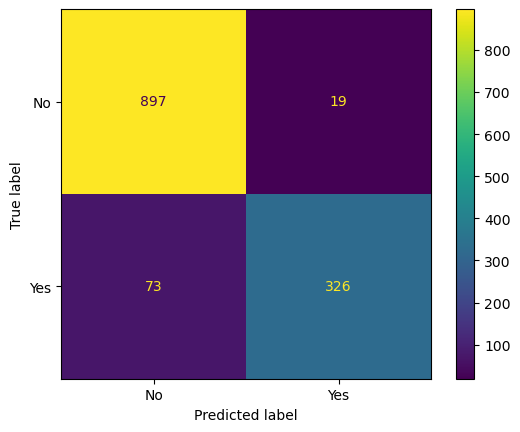
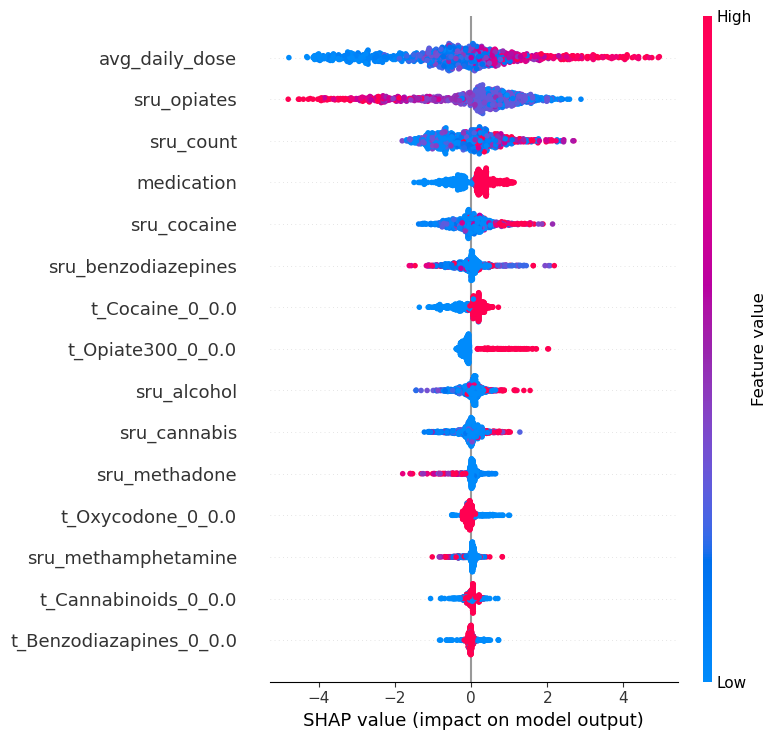

### Individual Level Predictive Modeling for Opioid Use Disorder Treatment Outcome
Jul 2023 - Present

I'm currently working on a personal project, where the goal is to show how machine learning can improve outcomes for treatment of Opioid Use Disorder (OUD).   I received guidance from Dr. Sean Luo, who designed the protocol for the project.

There is an Opioid Crisis in the united states, where close to 1,500 Americans are dying every week from Fentanyl.  Fentanyl is an artificially manufactured Opioid that is 100 times stronger than morphine.  Fentanyl has been increasingly prevalent in the illicit drug supply.  The DEA estimates that 6 out of 10 illicit pain pills are cut with Fentanyl.  People who are dying from Fentanyl are mostly working class people who suffered from chronic pain and were wrongly prescribed opiates, which are not designed for long term use.  If you are a veteran, you are disproportionately affected and are twice as likely to die from Fentanyl.  When people can't get pain meds through pharmacies, they will go through illicit channels and risk death from exposure to Fentanyl.

There is strong evidence indicating the effectiveness of opioid agonist treatment.  Mediations such as Methadone, Buprenorphine and Extended Release Naltrexone, can help prevent death from Fentanyl.  However, the prescription of these meds is mostly arbitrary, not backed by sound scientific evidence, mostly done for convenience, based on opinions.  Also, people who recover do so in different trajectories.  This creates a challenge and opportunity for precision medicine.  Personalized risk scores can promote patient centered care, similar to cancer treatment.

To address this problem, we observed dataset NIDA-CTN-0027 from the CTN.  This dataset includes data for about 1300 patients receiving treatment at 8 different centers.  We monitored medication doses, urine toxicology and self reported use, within the first 30 days of treatment.  We will try to take patient data and train a machine learning model to predict if a patient will or will not successfully complete treatment.

## Insights from Exploratory Data Analysis
### Self Reported Drug Use

 
Over a 24 week period, patients filled out surveys to report on drug use 
The data was collected at inception of treatment and every 4 weeks 
Specifically VISIT 0,4,8,12,16,20,24 

### Weekly Drug Tests

 
Patients submitted a urine sample for screening every week for 24 weeks

### Medication Doses

 
There is strong scientific evidence that medication will help prevent relapse from 50% - 90% 
Patients recover in distinct patterns, we hope to better understand the relationship between total dose
and recovery trajectory 

## Preliminary results training 3 different machine learning models

First we will run a basic classification model through random forrest 
Then we will try to interpret results through Global Surrogate model 
We will conclude with running XGBoost, a high performance ensemble learning model 
We will interpret those results using shapley values 
We will train a machine learning model on 1315 patient outcomes 
70% of outcomes are negative (relapse) 
30% of outcomes are positive (prevent relapse) 

 
The chart above is called a confusion matrix; the numbers are measured by two different metrics, namely precision and recall.  There is also an F1 score, which is the weighted average of both scores combined, listed as follows: 

**Precision** - The number of instances that are relevant, out of the total instances the model retrieved.   

True negatives are on the top left in yellow and true positives are on the bottom right in green.  The total between those two classes is 1,223, which represents a Precision score of 93% of 1315 patient outcomes were correctly classified.  

**Recall** - The number of instances which the model correctly identified as relevant out of the total relevant instances.  Essentially the true positive rate.  

To calculate recall, add true positives (326) with false positives (73), then divide true positive by total (399).  Recall is about 82%, which means we correctly predict postive patient outcomes 82% of the time. 

**F1 Score** is a weighted average of precision and recall or 2*((precision*recall)/(precision+recall)).  The F1 score is about 87%

## Shapley Values Analysis 
Comming soon 
 
Shapley values are based on cooperative game theory.  Essentially, the Shapley value is the average expected marginal contribution of one player after all possible combinations have been considered. 

The chart below looks at each feature as part of a coalition and the outcome of the model is viewed as a reward.  The reward get's fairly distributed amongst the features based on their contribution to the outcome.  Each dot on the axis represents a patient, where the color indicates contribution to model impact (high or low) and the direction indicates outcome (negatigve or positive) 

